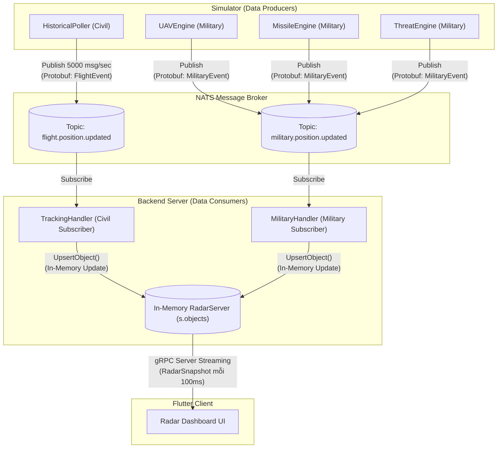

# Luồng Dữ Liệu NATS Message Broker Trong Hệ Thống Battlefield

Tài liệu này mô tả chi tiết bằng sơ đồ Mermaid về luồng dữ liệu của toàn bộ hệ thống, với trung tâm là NATS Message Broker. NATS đóng vai trò là xương sống (Backbone) kết nối giữa hệ thống phát sinh dữ liệu (Simulator) và hệ thống xử lý trung tâm (Backend).

## 1. Sơ Đồ Kiến Trúc Luồng NATS (NATS Flow Architecture)

Dưới đây là sơ đồ luồng dữ liệu hiện tại mô tả quá trình từ lúc sinh tọa độ ảo đến lúc hiển thị lên ứng dụng Flutter:

## 2. Diễn Giải Chi Tiết Các Thành Phần

### 2.1. Nhóm Data Producers (Simulator)
Simulator là một tiến trình Go riêng biệt, đóng vai trò là "Nhà sản xuất" (Producer) chuyên đẩy dữ liệu lên NATS.
- **HistoricalPoller:** Chịu trách nhiệm về mảng máy bay dân sự (Civil). Nó query DB mỗi 10 giây để lấy gốc tọa độ, sau đó tự dùng nội suy (Dead Reckoning) di chuyển hàng ngàn máy bay và Publish liên tục lên Topic `flight.position.updated`.
- **Các Military Engines (UAV, Missile, Threat):** Các module này tự động sinh (spawn) các đối tượng quân sự ngẫu nhiên, tự động tính toán hướng bay và Publish lên Topic `military.position.updated`. Tốc độ tick của nhóm này rất nhanh (10ms - 50ms).

### 2.2. NATS Message Broker
Đóng vai trò là ống dẫn tốc độ siêu cao (High-throughput Router). Nó tách biệt (decouple) hoàn toàn Simulator và Backend, đảm bảo nếu Backend bị lag thì Simulator vẫn không bị block. Dữ liệu chạy qua NATS hoàn toàn ở định dạng nhị phân cực nhẹ (Protobuf).

### 2.3. Nhóm Data Consumers (Backend)
Backend đóng vai trò là "Người tiêu thụ" (Consumer) từ NATS và là Server cho Client.
- **TrackingHandler & MilitaryHandler:** Lắng nghe liên tục trên 2 Topic của NATS. Khi có tín hiệu, chúng lập tức Deserialize Protobuf và tống thẳng đối tượng vào bộ nhớ RAM của `RadarServer`. Quá trình này đã được **Bypass toàn bộ I/O Database** để đạt độ trễ ~0.01ms.
- **RadarServer:** Nơi hội tụ (Aggregation) của tất cả dữ liệu. Nó giữ một biến `Map` duy nhất lưu trữ tọa độ tức thời mới nhất của toàn cầu.

### 2.4. gRPC Stream (Backend -> Flutter)
Dữ liệu NATS chỉ dừng lại ở Backend. Để truyền tới màn hình UI, `RadarServer` sử dụng gRPC Server Streaming. Thay vì đẩy từng đối tượng lẻ tẻ (sẽ làm cháy ứng dụng Flutter), Backend "gom" toàn bộ Map dữ liệu thành 1 khối (Snapshot) và truyền cho Flutter mỗi 100 mili-giây. Flutter nhận được Snapshot và Render trọn vẹn lên bản đồ `flutter_map`.
